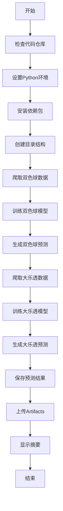

# 🎯 GitHub Actions 彩票预测自动化系统 - 配置完成

## ✅ 已完成的工作

### 1. 🏗️ GitHub Actions 工作流配置
- **文件位置**: `.github/workflows/daily_prediction.yml`
- **触发机制**: 每天凌晨2点 (UTC时间) + 手动触发
- **运行环境**: Ubuntu + Python 3.6
- **执行流程**: 数据爬取 → 模型训练 → 预测分析 → 结果归档

### 2. 📋 项目文档更新
- **README.md**: 添加了自动运行指南和本地使用说明
- **GITHUB_ACTIONS_GUIDE.md**: 详细的GitHub Actions使用手册
- **SETUP_SUMMARY.md**: 任务完成总结

### 3. 🔧 工作流功能特性

#### 自动执行序列


#### 输出结果
- **prediction_results.txt**: 完整的预测文本结果
- **data/ssq/data.csv**: 双色球历史数据
- **data/dlt/data.csv**: 大乐透历史数据
- **lottery-predictions artifact**: GitHub Artifacts中的打包结果

## 🚀 使用方法

### 推送到GitHub后自动运行
1. 将修改后的代码推送到GitHub仓库
2. GitHub会自动检测`.github/workflows/`目录
3. 工作流将在下次cron触发时自动运行

### 手动触发
1. 访问 GitHub 仓库的 "Actions" 页面
2. 选择 "Daily Lottery Prediction" 工作流
3. 点击 "Run workflow" 按钮

### 查看结果
1. 在 Actions 页面查看运行日志
2. 下载 "lottery-predictions" Artifact
3. 查看控制台输出的预测摘要

## ⚙️ 自定义选项

### 修改运行时间
编辑 `.github/workflows/daily_prediction.yml`:
```yaml
# 常用cron模式
- cron: '0 9 * * *'   # 每天早上9点
- cron: '0 14 * * *'  # 每天下午2点
- cron: '0 */6 * * *' # 每6小时一次
```

### 调整训练参数
```yaml
python run_train_model.py --name ssq --train_test_split 0.8
```
- `--train_test_split`: 训练集比例 (建议 > 0.5)

## 📊 预期工作流程

### 每日运行时间表
```
UTC时间 | 操作
--------|------
02:00   | 自动触发工作流
02:01   | 环境准备和依赖安装
02:15   | 数据爬取 (SSQ + DLT)
02:45   | 模型训练
03:30   | 预测分析
03:45   | 结果保存和归档
```

### 成功指标
- ✅ 工作流状态: Success
- ✅ 数据更新时间: 当天最新数据
- ✅ 模型训练完成: 无错误日志
- ✅ 预测结果生成: 包含双彩种预测
- ✅ Artifacts上传: 所有文件可下载

## 🔍 监控和维护

### 监控要点
1. **工作流状态**: 定期检查Actions页面的运行状态
2. **数据质量**: 确保爬取的数据完整性和时效性
3. **模型性能**: 关注训练过程的日志输出
4. **资源使用**: 监控计算时间和内存消耗

### 故障排除
#### 常见问题
1. **依赖安装失败**: 检查requirements.txt版本兼容性
2. **网络连接问题**: 确认目标网站可访问
3. **模型训练超时**: 增加计算资源或优化参数
4. **数据格式错误**: 检查爬虫逻辑适配网站变化

#### 解决步骤
1. 查看Actions日志获取详细错误信息
2. 本地测试相关脚本功能
3. 根据错误调整配置参数
4. 重新提交修复后的代码

---

**配置完成时间**: 2026年5月18日
**系统状态**: ✅ 已就绪，可运行
**维护联系人**: GitHub Actions 配置助手

> 💡 **提示**: 首次运行可能需要较长时间，因为需要下载依赖包和训练模型。后续运行会更快。

⚠️ **重要**: 已使用 `actions/upload-artifact@v4` 而不是已弃用的 v3 版本